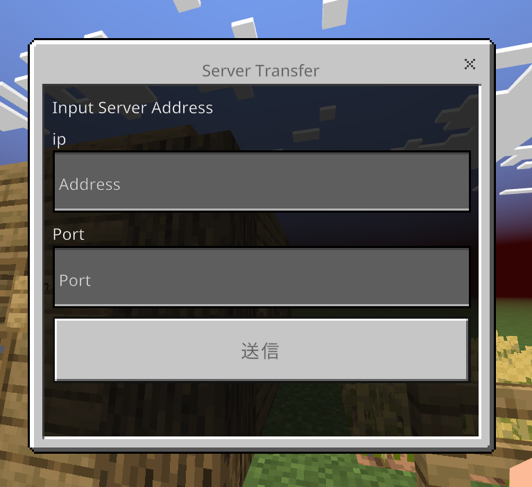

# GeyserServerTransferPlugin_GUIAddon

GUIで[GeyserServerTransferPlugin](https://github.com/Shin-Ideal/GeyserServerTransferPlugin)の機能を使えるようにするアドオン 
このプラグインだけでなく[GeyserServerTransferPlugin](https://github.com/Shin-Ideal/GeyserServerTransferPlugin)も入れる必要があります。

## How to Use?
1. `/betransfergui` を実行
2. guiの案内に従ってip,portを入力
3. 統合版ユーザーは、入力したサーバーに移動できます！

## Permission
* `GeyserServerTransferPlugin.command.betransfergui` GUIを開くための権限です。
